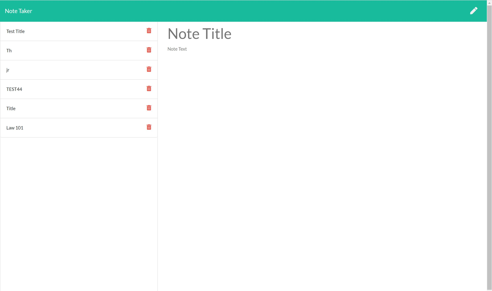
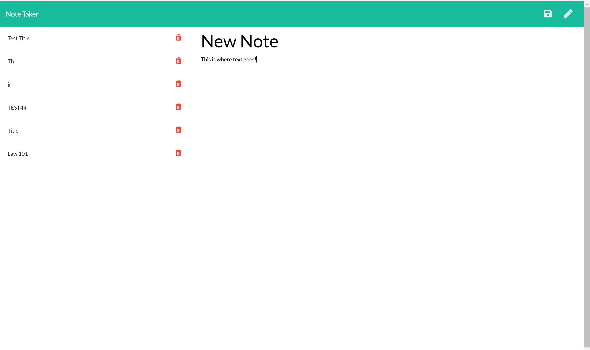

# All Aboard the Notetaker Express

## Description

This app allows you to take notes! It uses node.js, express.js, and uuid to create  notes, add notes, save them, delete them, and view them.

## Contents
* [Installation](#Installation)
* [Usage](#Usage)
* [Preview](#Preview)
* [Video Demo](#VideoDemo)
* [Deploy Link](#DeployLink)
* [Questions](#Questions)

## Installation

[Install Node.js](https://phoenixnap.com/kb/install-node-js-npm-on-windows)

You'll need to then install Express.js from the command line ```npm install express```

This app uses UUID for note security. Install it in the command line ```npm install uuid```

## Usage

After cloning and installing, you can run the server from the command line in VS Code. Go to http://localhost:3000. Check out the deploy link below as well!

## Preview 





## Video Demo 

https://youtu.be/oCVb0i6J4t4 

## Deploy Link

https://hw11notetakerr.herokuapp.com/notes

## License 


## Questions

[Email me!](mailto:josephtoups95@gmail.com)


